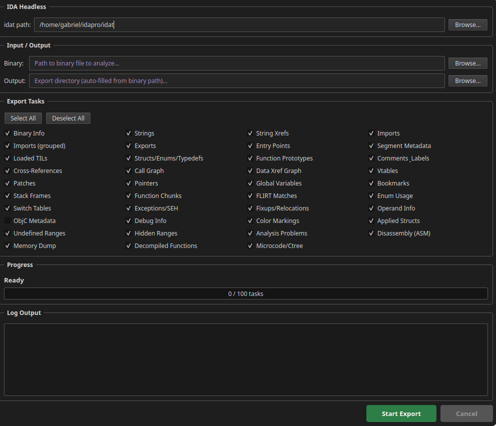

# idaxport

**IDA Pro export plugin for AI-assisted reverse engineering.**

Export everything IDA knows about a binary into plain text files that any AI tool can consume. 30+ export types covering decompiled code, disassembly, types, cross-references, call graphs, stack frames, and much more.

Fork of [P4nda0s/IDA-NO-MCP](https://github.com/P4nda0s/IDA-NO-MCP) with massively expanded exports and a Qt GUI.



## Usage

### Plugin Mode (with GUI)

Copy `INP.py` to the IDA plugins directory:

- **Windows**: `%APPDATA%\Hex-Rays\IDA Pro\plugins\`
- **Linux/macOS**: `~/.idapro/plugins/`

After restarting IDA:

- **Hotkey**: `Ctrl-Shift-E`
- **Menu**: `Edit` -> `Plugins` -> `Export for AI`

The GUI lets you select which exports to run, pick the output directory, and shows a progress bar with real-time log output.

### Standalone GUI

Launch the standalone dark-themed Qt GUI that runs IDA headless in the background:

```bash
python3 idaxport_gui.py
```

Pick your binary, choose an output directory, toggle export tasks with checkboxes, and hit **Start Export**. Progress bar and log update in real-time.

Requires: Python 3, PyQt5 (`pip install PyQt5`), and `idat` in your PATH or configured in the GUI.

### Headless / Batch Mode

```bash
idat -A -S"INP.py /path/to/output" /path/to/binary
```

## Exported Content

### Core Exports

| File/Directory | Content | Description |
|---|---|---|
| `binary_info.txt` | Binary metadata | Architecture, compiler, endianness, file type, statistics |
| `decompile/` | Decompiled C code | Each function as a `.c` file with name, address, callers, callees |
| `disassembly/` | Raw assembly | Each function as a `.asm` file with addresses, raw bytes, mnemonics |
| `microcode/` | Hex-Rays ctree | Intermediate representation per function |
| `strings.txt` | String table | Address, length, type (ASCII/UTF-16/UTF-32), content |
| `imports.txt` | Import table | `address:function_name` |
| `exports.txt` | Export table | `address:function_name` |
| `entry_points.txt` | Entry points | All entry points with ordinals |

### Type System

| File | Content | Description |
|---|---|---|
| `types.txt` | Structs/enums/typedefs | Full local type library with member offsets, types, sizes |
| `prototypes.txt` | Function prototypes | Hex-Rays inferred signatures for every function |
| `applied_structs.txt` | Applied struct types | Struct/union instances at specific data addresses |
| `enum_usage.txt` | Enum value usage | Where specific enum values appear as operands in code |

### Cross-References & Graphs

| File | Content | Description |
|---|---|---|
| `xrefs.txt` | Cross-references | Full code + data xref map with type classification |
| `callgraph.json` | Call graph | JSON adjacency list with function names |
| `data_xref_graph.json` | Data xref graph | Which functions read/write which global variables |

### Annotations & Analysis

| File | Content | Description |
|---|---|---|
| `comments.txt` | Comments & labels | Function comments, line comments, user-renamed labels |
| `segments.txt` | Segment metadata | Name, range, R/W/X permissions, class, bitness |
| `globals.txt` | Global variables | Names, addresses, types, and initial values |
| `stack_frames.txt` | Stack frame layouts | Local variable names, offsets, types per function |
| `bookmarks.txt` | Analyst bookmarks | Bookmarked addresses with descriptions |
| `colors.txt` | Color markings | Analyst-colored addresses |

### Binary Structure

| File | Content | Description |
|---|---|---|
| `vtables.txt` | Vtables / class info | Reconstructed vtables and RTTI data |
| `switch_tables.txt` | Switch tables | Jump table targets for switch statements |
| `exceptions.txt` | Exception handlers | SEH / try-catch / personality routines |
| `fixups.txt` | Relocations | Fixup/relocation entries |
| `patches.txt` | Patched bytes | Original vs patched byte values |
| `pointers.txt` | Pointer references | Data xrefs + raw pointer scan with classification |
| `flirt_matches.txt` | FLIRT matches | Functions identified by signature matching |

### Platform-Specific

| File | Content | Description |
|---|---|---|
| `objc_metadata.txt` | ObjC metadata | Selectors, classes, ivars for iOS/macOS binaries |
| `debug_info.txt` | Debug info | Source file/line mappings (DWARF) |

### Raw Data

| File/Directory | Content | Description |
|---|---|---|
| `memory/` | Memory hexdump | 1MB chunks per segment with hex + ASCII |
| `function_index.txt` | Function index | Summary with call relationships |
| `decompile_failed.txt` | Failed list | Functions that failed to decompile |

## Features

- **Qt GUI** with checkboxes for each export, progress bar, and log output
- **30+ export types** covering every aspect of binary analysis
- **Resumable** — progress saved to disk; re-run picks up where it left off
- **Memory-optimized** — streams one function at a time, aggressive GC
- **IDA 9.x compatible** — tested with IDA Pro 9.2 headless (`idat`)
- **Parallel I/O** — thread pool for file writes
- **Graceful fallback** — headless mode works without Qt

## Example Output

```c
/*
 * func-name: process_person
 * func-address: 0x1179
 * callers: 0x1303
 * callees: 0x1050, 0x1070
 */

void __fastcall process_person(Person *p, int multiplier)
{
  char buffer[64];
  int temp = multiplier * p->age;
  snprintf(buffer, 64, "%s is %d (adjusted: %d)", p->name, p->age, temp);
  printf("%s at (%d, %d) likes color %d\n", buffer, p->location.x, p->location.y, p->favorite);
  g_counter += temp;
}
```

## License

MIT
